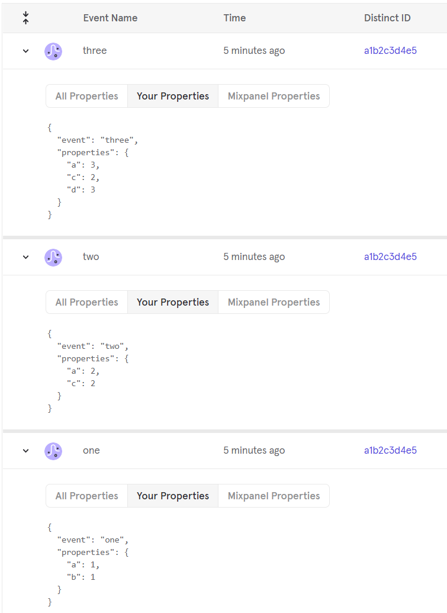

<h3 align="center">shinymixpanel</h3>
<h4 align="center">
  🔍 Track user interactions with Mixpanel in Shiny apps or R scripts
  <br><br>
  by <a href="https://deanattali.com">Dean Attali</a>
</h4>

<p align="center">
  <a href="https://github.com/daattali/shinymixpanel/actions">
    
  </a>
  <a href="https://cran.r-project.org/package=shinymixpanel">
    
  </a>
</p>

---

[Mixpanel](https://mixpanel.com/) is an analytics platform allowing you to track user interactions (called **events**) on your web apps. The {shinymixpanel} package provides an easy way to track events to Mixpanel from R. For Shiny developers, this means you can track events in Shiny apps, such as when a user clicks on a button, types into an input, selects a tab, or any other action you want to track. 

All events data for all users can be viewed on [Mixpanel's dashboard](https://mixpanel.com/).

**Need Shiny help? [I'm available for consulting](https://attalitech.com/).**<br/>
**If you find {shinymixpanel} useful, please consider [supporting my work](https://github.com/sponsors/daattali)! ❤**

<p align="center">
  <a style="display: inline-block;" href="https://github.com/sponsors/daattali">
    
  </a>
  <a style="display: inline-block;" href="https://paypal.me/daattali">
    
  </a>
</p>

> This package is part of a larger ecosystem of packages with a shared vision: solving common Shiny issues and improving Shiny apps with minimal effort, minimal code changes, and clear documentation. Other packages for your Shiny apps:

| Package | Description | Demo |
|---|---|---|
| [shinyjs](https://deanattali.com/shinyjs/) | 💡 Easily improve the user experience of your Shiny apps in seconds | [🔗](https://deanattali.com/shinyjs/overview#demo) |
| [shinyalert](https://github.com/daattali/shinyalert/) | 🗯️ Easily create pretty popup messages (modals) in Shiny | [🔗](https://daattali.com/shiny/shinyalert-demo/) |
| [shinyscreenshot](https://github.com/daattali/shinyscreenshot/) | 📷 Capture screenshots of entire pages or parts of pages in Shiny apps | [🔗](https://daattali.com/shiny/shinyscreenshot-demo/) |
| [timevis](https://github.com/daattali/timevis/) | 📅 Create interactive timeline visualizations in R | [🔗](https://daattali.com/shiny/timevis-demo/) |
| [shinycssloaders](https://github.com/daattali/shinycssloaders/) | ⌛ Add loading animations to a Shiny output while it's recalculating | [🔗](https://daattali.com/shiny/shinycssloaders-demo/) |
| [colourpicker](https://github.com/daattali/colourpicker/) | 🎨 A colour picker tool for Shiny and for selecting colours in plots | [🔗](https://daattali.com/shiny/colourInput/) |
| [shinybrowser](https://github.com/daattali/shinybrowser/) | 🌐 Find out information about a user's web browser in Shiny apps | [🔗](https://daattali.com/shiny/shinybrowser-demo/) |
| [shinydisconnect](https://github.com/daattali/shinydisconnect/) | 🔌 Show a nice message when a Shiny app disconnects or errors | [🔗](https://daattali.com/shiny/shinydisconnect-demo/) |
| [shinytip](https://github.com/daattali/shinytip/) | 💬 Simple flexible tooltips for Shiny apps | WIP |
| [shinyforms](https://github.com/daattali/shinyforms/) | 📝 Easily create questionnaire-type forms with Shiny | WIP |

# Table of contents

  - [Sponsors](#sponsors)
  - [Installation](#install)
  - [One-time setup](#initial-setup)
  - [How to use](#usage)
  - [Identifying users](#identify)
  - [Event properties](#props)
  - [Getting around ad blockers](#adblockers)
  - [Using {shinymixpanel} during development/testing](#testing)
  - [Outside of Shiny apps](#server)
  
<h2 id="sponsors">Sponsors 🏆</h2>

- This work was partially funded by [Domino Data Lab](https://www.dominodatalab.com/)

[Become a sponsor for
{shinymixpanel}](https://github.com/sponsors/daattali/sponsorships?tier_id=39856) and unlock special rewards!

<h2 id="install">Installation</h2>

**For most users:** To install the stable CRAN version:

```r
install.packages("shinymixpanel")
```

**For advanced users:** To install the latest development version from GitHub:

```r
install.packages("remotes")
remotes::install_github("daattali/shinymixpanel")
```

<h2 id="initial-setup">One-time setup</h2>

To use {shinymixpanel}, you must first have a [Mixpanel](https://mixpanel.com/) account (you can sign up for free), create a project, and obtain the *Project Token* from the *Project Settings* page. Keep this project token handy as it's required in order to use {shinymixpanel}. 

<h2 id="usage">How to use</h2>

To use {shinymixpanel} in a shiny app, **you must first to call `mp_init()` anywhere in the app's UI**. Then you can call `mp_track()` in the server to track any user interaction. The first argument to `mp_track()` is the event name, and you can optionally also pass a list of additional properties that will get recorded with this event. Below is a simple example:

```r
library(shiny)
library(shinymixpanel)

mixpanel_token <- "PROJECT_TOKEN_HERE"

ui <- fluidPage(
  mp_init(mixpanel_token),
  textInput("name", "name", ""),
  actionButton("btn", "btn")
)

server <- function(input, output, session) {
  mp_track("app started")
  
  observeEvent(input$btn, {
    mp_track(
      "clicked button",
      list(num = btn, name = input$name)
    )
  })
}

shinyApp(ui, server)
```

### Project token

A project token must either be passed to `mp_init()` as the `token` parameter, or you can set the `SHINYMIXPANEL_TOKEN` environment variable.

<h2 id="identify">Identifying users</h2>

All events tracked to Mixpanel from the same browser will be associated with the same user ID. By default, Mixpanel will use a random ID for each user. If you want to set your own user ID for the current user, you can either provide the user ID to `mp_init()` via the `userid` parameter, or by calling `mp_userid()` in the server.

Once a user ID is set (whether randomly or explicitly), all subsequent `mp_track()` calls in the same browser will be associated with that user, until a new user ID is set.

<h2 id="props">Event properties</h2>

Any event that gets tracked to Mixpanel can include additional information, called **Properties**. This is usually either extra information about the event itself, or about the user. Mixpanel automatically attaches many properties to events, and you can also send additional custom properties. For example:

```r
mp_track("submit form", properties = list(name = input$name, form_version = 2))
```

### Default properties

If there are any properties that you want to attach to all subsequent events, you can define a set of default properties either using the `default_properties` parameter of `mp_init()`, or by calling `mp_default_props()` at any time in the server. Below is an example of how default properties work:

```r
ui <- fluidPage(
  mp_init(mixpanel_token, default_properties = list(a = 1, b = 1))
)

server <- function(input, output, session) {
  mp_track("one")
  mp_default_props(list(a = 2, c = 2))
  mp_track("two")
  mp_track("three", list(a = 3, d = 3))
}

shinyApp(ui, server)
```

The app above makes three event tracking calls, and sets default properties twice: first in the initialization (`mp_init()`), and later with a server call (`mp_default_props()`). The following screenshot shows the results that are recorded by Mixpanel (it might be easier to read from bottom to top since the last event is on top):



As you can see, any time that default properties are set, it overwrites any previous default properties. Additionally, if a property name is duplicated in the default properties and in the `mp_track()` call, the property in `mp_track()` takes precedence.

### Default JavaScript properties

There may be some information you'd like to track that's only accessible from the client side (from the browser, not from R). To retrieve properties from the client and attach them to any `mp_track()` call, you define the properties in the `default_properties_js` parameter of `mp_init()`. The difference between `default_properties_js` and the regular default properties is that `default_properties_js` takes JavaScript code, and it's computed as soon as Mixpanel is initialized.

For example, using the following call:

```r
mp_init(mixpanel_token, default_properties_js = list(
  size = "screen.width", ua = "navigator.userAgent", domain = "location.hostname"))
```

Will result in 3 variables getting computed right away in the user's browser: "size" (the screen's width), "ua" (the browser's user-agent string), and "domain" (the current webpage's domain). These 3 properties will be sent along with any `mp_track()` calls.

<h2 id="adblockers">Getting around ad blockers</h2>

By default, {shinymixpanel} attempts to send all event tracking via the user's browser (using Mixpanel's JavaScript API). This is the preferred way to use Mixpanel, as it automatically gathers some user data from the web browser and sends many additional properties.

However, some users may disable tracking through their browser -- for example using an ad blocker -- and for these users it's not possible to connect to Mixpanel through the browser. Luckily, {shinymixpanel} has an easy solution to this: setting `track_server = TRUE` in `mp_init()`.

When `track_server` is off, then any browser that is blocked from communicating with Mixpanel will simply not send Mixpanel any events. But if `track_server` is on, then {shinymixpanel} will send events to Mixpanel using server API calls (Mixpanel's REST API) when the browser is blocking Mixpanel tracking. When this happens, {shinymixpanel} will even try to detect some user data and send it along as additional properties: browser type, screen size, operating system, and current URL.

<h2 id="testing">Using {shinymixpanel} during development/testing</h2>

While developing or testing your Shiny app, you may not want to have Mixpanel tracking turned on. You have two options:

1. Mixpanel tracking can be temporarily disabled by setting the `SHINYMIXPANEL_DISABLE` environment variable to "1". When this environment variable is set, any calls to `mp_init()` and `mp_track()` are ignored.

2. You may prefer to still use Mixpanel, but send the data to a different "test" project rather than the real production Mixpanel project. This is supported via the `test_token` and `test_domains` parameters of `mp_init()`.

    When both of these parameters are provided, if the Shiny app is in a domain that's listed in the `test_domains` list, then data will be sent to the `test_token` project instead. Note that the domains in `test_domains` are assumed to be suffixes. This means that if you provide "example.com" as a test domain, then any user on `example.com` or `test.example.com` will use the test project.
  
    By default, `test_domains` is set to `127.0.0.1` and `localhost`, which means that if you provide a `test_token`, that project will receive all data while you're running the Shiny app locally. 

<h2 id="server">Outside of Shiny apps</h2>

Even though {shinymixpanel} was mainly developed with Shiny apps in mind (using Mixpanel's client-side API), it can also be used to send events to Mixpanel from any R code using Mixpanel's server-side API.

To use {shinymixpanel} in a non-Shiny context, you don't need to call `mp_init()`. Rather, you can just call `mp_track_server()` at any time. A token must be provided, either via the `token` argument or by setting the `SHINYMIXPANEL_TOKEN` environment variable. If you call `mp_userid()` or `mp_default_props()`, then all subsequent event trackings will use the corresponding user ID and properties, just like in the client-side version.

The main advantage of client-side event tracking is that it will automatically gather some user data from the web browser and send it as additional properties. The main advantage of server-side tracking is that it cannot be blocked by a browser's ad blocker.

Here is an example of using {shinymixpanel} outside of Shiny:

```r
Sys.setenv("SHINYMIXPANEL_TOKEN" = YOUR_PROJECT_TOKEN)
mp_userid("abcd1234")
mp_default_props(list("foo" = "bar", "text" = "hello"))
mp_track_server("greet", list(name = "dean"))
```

The above code will send a "greet" event to Mixpanel, associate it to user "abcd1234", along with properties {"foo" = "bar", "text" = "hello", "name" = "dean"}.

Note that calling `mp_track()` outside of a Shiny app is always equivalent to calling `mp_track_server()`. Calling `mp_track()` inside a Shiny app will attempt to use the client-side API, but if an ad blocker is used and `track_server` is on, then `mp_track_server()` will be used as an alternative.
